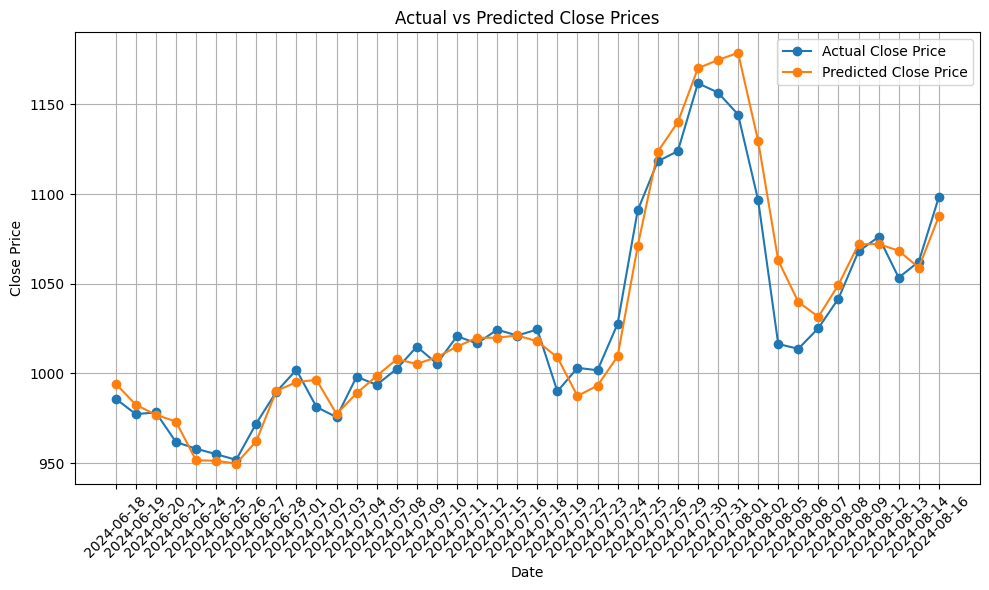

# TataMoters-Stock-Price-Prediction-LSTM
A project for predicting Tata Motors stock prices using LSTM neural networks. It includes historical data from July 1991 to June 2024, with notebooks for model training, testing, and evaluation. The repo features datasets, model files, and performance metrics.

## Project Structure

1. **DataSets**
   - **TATAMOTORS_02_JUN_1991_14_JUN_2024.csv**: Contains historical stock price data used for training the model.
   - **TATAMOTORS_18_JUN_2024_18_AUG_2024.csv**: Contains stock price data for testing the model on one month that was not included in the training data.
   - **TATAMOTORS_18_Aug_2019_18_JUN_2024.csv**: A sample dataset containing training data.
   - **TATAMOTORS_2000_2021.csv**: A sample dataset containing training data.

   All datasets (excluding `TATAMOTORS_2000_2021.csv`) are downloaded from [Yahoo Finance](https://finance.yahoo.com/quote/TATAMOTORS.NS/history/).

2. **TataMotor_Stock_Price_Predictions_v1.ipynb**
   - Contains the code for training the LSTM model, including data preprocessing and model training.

3. **Model_Prediction_Test_v1.ipynb**
   - Tests the trained model with the test dataset and provides sample usage of the model.

4. **TataMotors_Stock_Price_Prediction_Model_LSTM_v1.h5**
   - The saved LSTM model and its weights.

5. **scaler_v1.save**
   - Saved scaler used for transforming input features before prediction.

6. **requirements.txt**
   - Lists all the library requirements for the project. Note: Some libraries are specific to Linux and Apple Silicon M1/M2 (e.g., `tensorflow-macos`, `tensorflow-metal`).

## Prediction vs Actual Values

The following graph compares the actual close prices with the predicted close prices using the LSTM model.

## Evaluation Metrics

The model's performance is evaluated using the following metrics:

- **Mean Absolute Error (MAE)**: 10.63
  - Measures the average magnitude of errors in predictions, without considering their direction.
- **Root Mean Squared Error (RMSE)**: 14.41
  - Measures the square root of the average of the squares of the errors. It gives more weight to larger errors.

## Usage

1. Load the scaler and model.
2. Prepare the input data and scale it.
3. Make predictions using the model.
4. Evaluate the model's performance using metrics and visualize predictions.

Feel free to explore and modify the code for further experimentation and improvements.
